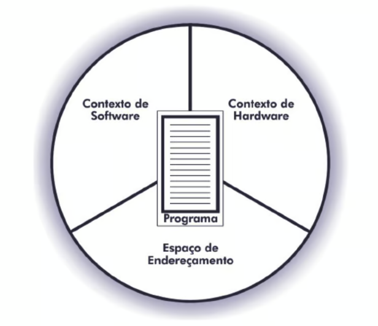
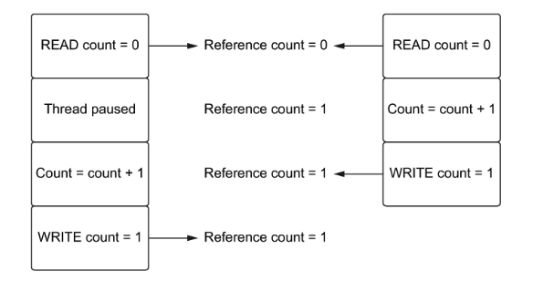
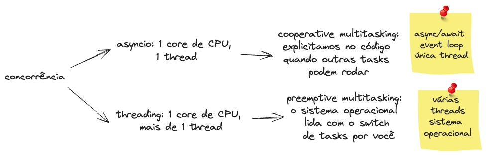

O objetivo deste texto é dar um resumo direto ao ponto dos **conceitos básicos necessários para entender sobre concorrência a paralelismo na linguagem Python**. Recomendo ter uma base mínima sobre o assunto ou aliar esse texto com estudo em outras fontes. Todas as referências estão ao final do texto. 

Abordarei os seguintes tópicos:

- [O que é um processo?](#1)
- [O que são threads?](#2)
- [O que significa I/O bound e CPU bound?](#3)
- [O que é o GIL do Python?](#4)
- [O que é concorrência?](#5)
- [O que é paralelismo?](#6)
- [A biblioteca asyncio](#7)
- [A biblioteca threading](#8)
- [A biblioteca multiprocessing](#9)

## O que é um processo?
Em computação um **processo é uma instância de uma aplicação rodando**. Se você abrir uma aplicação no seu computador, como o navegador, essa aplicação vai estar associada a algum processo. Um processo é composto por:

- Contexto de hardware: armazena conteúdo de registradores gerais e específicos da CPU
- Contexto de software: especifica os recursos que podem ser alocados pelo processo
- Espaço de endereçamento: especifica a área da memória que o processo pertence

A imagem a seguir foi retirada do [livro do Francis Machado e do Luis Maia](https://www.amazon.com.br/Arquitetura-Sistemas-Operacionais-Incluindo-Exerc%C3%ADcios/dp/8521622104/ref=sr_1_1?__mk_pt_BR=%C3%85M%C3%85%C5%BD%C3%95%C3%91&crid=150WW8OAI7BK3&dib=eyJ2IjoiMSJ9.A1ZhX8ImePrgue4fqDmOFhTfVbkIf5kIlU2jq5kd4laG4KvRRBXQekMR1rhx34OdkcpofR8kV8Ln0SjtzbN9on9rfe1wq8VNaqPBEYyuFuE.byPfWCKB9260AyrDAXjLab022xEJbcexS5jc_qZgex0&dib_tag=se&keywords=Arquitetura+de+Sistemas+Operacionais%3A+Incluindo+Exerc%C3%ADcios+com+o+Simulador+SOSIM+e+Quest%C3%B5es+do+ENADE&qid=1720896386&sprefix=arquitetura+de+sistemas+operacionais+incluindo+exerc%C3%ADcios+com+o+simulador+sosim+e+quest%C3%B5es+do+enade%2Caps%2C137&sr=8-1):

Essas informações são necessárias para a execução de um programa.

## O que são threads?
Uma **thread é uma sub-rotina de um programa, sendo a menor unidade de execução que um sistema operacional gerencia e componente de um processo**.

As várias threads de um processo hipotético podem ser executadas concorrentemente (que entenderemos em breve), compartilhando recursos como memória. Diferentes processos não compartilham esses recursos.

A imagem abaixo foi retirada do [Wikipedia](https://en.wikipedia.org/wiki/File:Concepts-_Program_vs._Process_vs._Thread.jpg#filelinks):

Interpretando a imagem acima, podemos extrair que um programa fica salvo em disco (memória secundária, não-volátil) e inclui várias instruções, podendo ser instanciado (iniciado) em um ou mais processos, e esses por sua vez podem ter várias threads associadas.

## O que significa I/O bound e CPU bound?
Essas duas expressões aparecem bastante na discussão sobre concorrência e podem aparecer em português com E/S (entrada/saída) e UCP (unidade central de processamento). 

Quando falamos sobre I/O bound e CPU bound estamos falando dos fatores limitantes que previnem uma operação de rodar mais rápido em nosso computador, e podemos encontrar esse dois tipos de operações na mesma codebase.

**Uma operação CPU bound faz uso intenso da CPU, e rodará mais rápido se a CPU for mais poderosa**. Ou seja, se formos de 2GHz para 4GHz de velocidade de clock essa operação provavelmente rodará mais rápido. Estamos falando aqui de operações que realizam muitas computações, cálculos; a exemplo, como calcular Pi.

**Uma operação I/O bound depende da velocidade da rede e velocidade dos dispositivos de entrada e saída**. Fazer um request a um servidor web ou ler um arquivo do disco são operações I/O bound.

Ambos os tipos de operações podem se beneficiar do uso de concorrência.

## O que é o GIL do Python?
GIL significa **global interpreter lock (bloqueio do interpretador global), cujo objetivo é prevenir um processo Python de executar mais de um bytecode de instrução Python ao mesmo tempo**. Para rodar uma thread é necessário "adiquirir" o GIL e enquanto uma thread detém o GIL outra thread não pode adiquiri-lo ao mesmo tempo. Isso não significa que não podemos ter mais de uma thread nesse contexto. 

Aqui estamos considerando a implementação de referência do Python. **O CPython é a implementação padrão do Python**, usada como referência de como a linguagem se comporta. Existem outras implementações, como Jython ou IronPython. O GIL está presente no CPython e só recentemente tivemos uma [PEP (Python Enhancement Proposal - proposta de melhoria do Python) propondo tornar o GIL opcional](https://peps.python.org/pep-0703/).

A ideia do GIL é prevenir _race conditions_, que podem surgir quando mais de uma thread precisa referenciar um objeto Python ao mesmo tempo. Se mais de uma thread modificar uma variável compartilhada essa variável pode ficar em um estado inesperado. Imagem retirada do [livro do Matthew Fowler](https://www.amazon.com.br/Python-Concurrency-Asyncio-Matthew-Fowler/dp/1617298662/ref=sr_1_3?__mk_pt_BR=%C3%85M%C3%85%C5%BD%C3%95%C3%91&crid=FRBELDMJHT23&dib=eyJ2IjoiMSJ9.5wyYTHKbZ2idvH8GDqdbsq8qRPv7t5SNNgCQixjEVop7TeR9YRqA66AL9DV1wY3BDFdBJN0pwlU42loLLQGPfFRIKTBDWUW3NzW89oL-TWOnyuyCSLBpYg32aUEyvo5Et8n9sA-Feyh4aMTTeEGydk8r9QKSR-i9FHsBOteOdSn9pQuhlgSHG2YU0jZ4FiaBOXUznz3Ka7XEtQc_ctlNnBN0sDGXPuLqYVgpyhEEYAGP6aTFzdY-SsLaB3duqYq9r15Q6Ux3Zat5I4eqg68T6Gf_jVopvKUv8QJ_je91pOA.eYk31md2uMKA_h8es6XGgFyU1luNGSDMeCdmmaPw0Yc&dib_tag=se&keywords=asyncio&qid=1720900096&sprefix=asyncio%2Caps%2C170&sr=8-3&ufe=app_do%3Aamzn1.fos.a492fd4a-f54d-4e8d-8c31-35e0a04ce61e):

Na imagem acima duas threads estão tentando incrementar uma reference count simultaneamente, e aí ao invés da contagem dar 2, já que as duas estão incrementando 1, o resultado final dá 1 (cada thread é uma coluna).

## O que é concorrência?
Concorrência em computação acontece quando **lida-se com mais de uma tarefas, sem necessariamente estar executando essas duas tarefas exatamente ao mesmo tempo**. Uma frase conhecida do [Rob Pyke](https://en.wikipedia.org/wiki/Rob_Pike) sobre o assunto:

> Concorrência significa **lidar** com muitas coisas ao mesmo tempo. Paralelismo é **fazer** muitas coisas ao mesmo tempo.

Pense nessa situação hipotética: se você for fazer dois bolos, pode começar pré-aquecendo o forno e, enquanto isso, prepara a massa do primeiro bolo. Assim que o forno estiver na temperatura correta você já pode colocar a massa do primeiro bolo no forno e, enquanto aguarda o bolo crescer no forno, já pode preparar a massa do segundo bolo. A ideia de concorrência é basicamente essa, você não precisa ficar ocioso, travado, parado, enquanto aguarda uma tarefa completar, você pode fazer um _switch_ e trocar de tarefa.

Nesse contexto, temos dois tipos de multitasking:

- **Cooperative multitasking**: nesse modelo explicitamos no código os pontos onde se pode fazer o _switch_ de tarefas. No Python isso é alcançado com o uso de um event loop, um design pattern comum, usando apenas uma thread e um core de CPU, usando, por exemplo, o `asyncio` com `async` e `await`
- **Preemptive multitasking**: nesse modelo deixamos o sistema operacional lidar com o _switch_. No Python isso é alcançado com mais de uma thread e um core de CPU usando, por exemplo, a lib `threading`

A imagem abaixo ajuda a sumarizar concorrência em Python:

## O que é paralelismo?
**Paralelismo significa que mais de uma task está sendo executada ao mesmo tempo**. Em outras palavras, paralelismo implica concorrência (lidar com mais de uma task), mas concorrência não implica paralelismo (tasks não estão necessariamente sendo executadas em paralelo, ao mesmo tempo). Para que paralelismo seja possível precisamos de mais de um core de CPU. 

No Python paralelismo é alcançado, por exemplo, com a lib `multiprocessing`, onde teremos mais de um processo Python, cada um com seu GIL. A imagem ajuda a ilustrar paralelismo em Python:

## A biblioteca asyncio
Existem formas diferentes de se atingir concorrência e paralelismo em Python e podemos utilizar algumas bibliotecas para otimizar nosso código, a depender do tipo de operação que estamos lidando, I/O bound ou CPU bound. O [`asyncio`](https://docs.python.org/pt-br/3/library/asyncio.html) é uma **lib para atingir concorrência usando o `async` e `await`**. Pela documentação:

> O asyncio é usado como uma base para várias estruturas assíncronas do Python que fornecem rede e servidores web de alto desempenho, bibliotecas de conexão de banco de dados, filas de tarefas distribuídas etc.

Como você pode imaginar, essa lib é adequada para otimizar tarefas I/O bound, onde temos tempo de espera de network, escrita em disco, etc. Numa operação CPU bound não há espera, dependemos apenas da velocidade de cálculo da CPU.

## A biblioteca threading
**A lib [`threading`](https://docs.python.org/pt-br/3/library/threading.html) do Python nos permite operar mais de uma thread**, porém, continuamos a lidar com um core de CPU e um processo Python, e lembre-se de que esse é um caso de preemptive multitasking onde o sistema operacional faz a troca de tarefas por nós. A lib também é mais útil para otimizar operações I/O bound.

Sobre o `threading`, o site [Real Python](https://realpython.com/python-concurrency) traz alguns pontos importantes:

> Porque o sistema operacional está no controle de quando uma task será interrompida e outra task irá começar, qualquer dado que for compartilhado entre as threads precisa ser protegido, ou _thread-safe_. Infelizmente `requests.Session()` não é _thread-safe_. Existem várias estratégias para fazer o acesso de dados _thread-safe_ a depender de que dado é e como você está usando. Uma delas é usar estruturas de dados _thread-safe_ como `Queue` do módulo `queue` do Python.

Encontramos a documentação do [`queue` aqui](https://docs.python.org/pt-br/3/library/queue.html#module-queue).

## A biblioteca multiprocessing
Sobre a lib [`multiprocessing`](https://docs.python.org/pt-br/3/library/multiprocessing.html) na documentação do Python:

> `multiprocessing` é um pacote que suporta gerar processos usando uma API similar ao módulo `threading`. O pacote `multiprocessing` oferece concorrência tanto local quanto remota, efetivamente desviando o GIL usando sub-processos ao invés de threads. Por isso o **módulo `multiprocessing` permite o programador aproveitar múltiplos processadores em uma máquina**.

Vale apontar que rodar mais de um processo em diferentes cores de CPU não significa desabilitar o GIL, e sim que cada processo terá o seu próprio GIL. Por aproveitar de mais de um core de CPU, compartilhando workloads pesados de CPU entre os múltiplos cores dispiníveis, a lib é mais adequada a CPU bound.

---
_Fontes_:

FOWLER, Matthew. [Python Concurrency with asyncio](https://www.amazon.com.br/Python-Concurrency-asyncio-English-Matthew-ebook/dp/B09S4NBW2X/ref=tmm_kin_swatch_0?_encoding=UTF8&dib_tag=se&dib=eyJ2IjoiMSJ9.hrCR3O_nnpP3z502Q_U-90OBMrmIMAXl3zIBDIRAa6ZtVFLXDmHRGneAJVIt0nU80CejmcvLhZvK60Jk1LpM3sO1Mqe9MtF1AXr4H3gRLKprHITsENvjoIvmTmfRkV0hF7peJqUAB8EJUejNW-0jVMq4kuzVS_6ku0Q-0Ge1M1V1O147m3K1c1gU8BQwioqpdimWwJBO7TUvxtDEIRjC9ASkmKNr46PqT5JL2jpcK-jbEw-_nYSxPk0lHmW_XBMngMORwj2znV96dfoUXACcfQJ04lRRbHDJmYhkyZNaN4k.IURAGkadqEEUNyjwE5NoLWNseUJm58Vopo-2CV2n5U4&qid=1720896914&sr=8-1). Manning Publications, 2022.

MACHADO, Francis Berenger; MAIA, Luiz Paulo. [Arquitetura de Sistemas Operacionais: Incluindo Exercícios com o Simulador SOSIM e Questões do ENADE](https://www.amazon.com.br/Arquitetura-Sistemas-Operacionais-Incluindo-Exerc%C3%ADcios/dp/8521622104/ref=sr_1_1?__mk_pt_BR=%C3%85M%C3%85%C5%BD%C3%95%C3%91&crid=150WW8OAI7BK3&dib=eyJ2IjoiMSJ9.A1ZhX8ImePrgue4fqDmOFhTfVbkIf5kIlU2jq5kd4laG4KvRRBXQekMR1rhx34OdkcpofR8kV8Ln0SjtzbN9on9rfe1wq8VNaqPBEYyuFuE.byPfWCKB9260AyrDAXjLab022xEJbcexS5jc_qZgex0&dib_tag=se&keywords=Arquitetura+de+Sistemas+Operacionais%3A+Incluindo+Exerc%C3%ADcios+com+o+Simulador+SOSIM+e+Quest%C3%B5es+do+ENADE&qid=1720896386&sprefix=arquitetura+de+sistemas+operacionais+incluindo+exerc%C3%ADcios+com+o+simulador+sosim+e+quest%C3%B5es+do+enade%2Caps%2C137&sr=8-1). Rio de Janeiro: LTC, 2013.

[Thread (computing) por Wikipedia](https://en.wikipedia.org/wiki/Thread_(computing))

[Speed Up Your Python Program With Concurrency por Real Python](https://realpython.com/python-concurrency)
